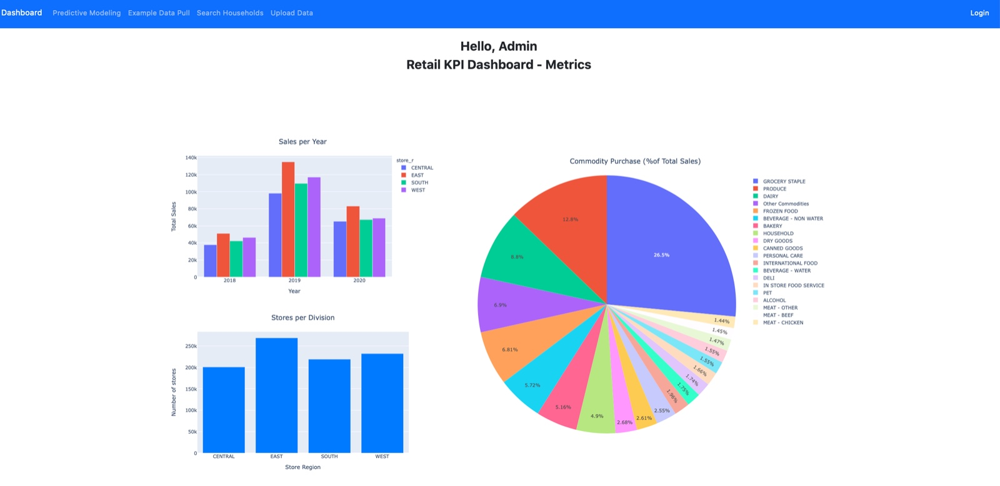

# 📊 KroDash: Your Go-To Retail Data Dashboard 

**Welcome aboard!** This is the Kroger Retail Data Dashboard, your ultimate tool for diving deep into Kroger’s retail data. Whether you're looking to understand sales trends, customer behavior, or inventory management, this dashboard has got you covered. Let's make data analysis fun and insightful! 🚀

## 🧐 Questions We Answer 
- How have Kroger's overall sales trends evolved over the past few years?
- Which product categories are the top contributors to total sales?
- How do sales vary across different divisions?
- What are the key customer demographics and their purchasing behavior?
- Are there any noticeable patterns in inventory turnover?

## 📸 Dashboard Overview 


## 🌟 Cool Features
- **Sales Performance Analysis**  
  Visualize sales trends over time, including total sales, sales by product department, and sales by store location.

- **Inventory Management**  
  Track inventory levels, identify top-selling products, and monitor stock levels to optimize inventory management.

- **Interactive Filters**  
  Use interactive filters to drill down into specific years, product categories, and divisions.

- **Data Visualization**  
  Includes charts and graphs to represent data intuitively and facilitate quick analysis.

## 🛠️ Tech Stack 
- **Backend**: Flask for web development and SQLAlchemy for ORM.
- **Frontend**: HTML, CSS, and JavaScript for a dynamic user interface; Bootstrap for responsive design and styling.
- **Deployment**: Hosted on Heroku with data stored in Azure PostgreSQL.

## ⚙️ Getting Started 

*Note: To run this repository, you need to have PostgreSQL installed on your local machine or use a cloud-based PostgreSQL service such as Heroku Postgres, Amazon RDS, Google Cloud SQL, or Azure Database for PostgreSQL. This project specifically uses Azure Database for PostgreSQL. Ensure PostgreSQL is properly set up and accessible, then update the project's configuration file with the database connection details.*

Follow these steps to set up KroDash on your local machine:

1. **Clone the repository:**
   ```bash
   git clone https://github.com/RJoshi141/KroDash.git
   ```

2. **Navigate into the project directory:**
   ```bash
   cd KroDash
   ```

3. **Install Python dependencies:**
   ```bash
   pip install -r requirements.txt
   ```

4. **Start the application:**
   ```bash
   flask run
   ```

5. **Finally, navigate to:**
   [http://127.0.0.1:5000/](http://127.0.0.1:5000/)

## 🤝 Contributing 
Have an idea to make KroDash even better? Found a bug? We welcome contributions! Feel free to open an issue or submit a pull request. Let's build something amazing together.

## 📬 Get in Touch 
Got questions, feedback, or just want to chat? Reach out to me:

- **GitHub**: [RJoshi141](https://github.com/RJoshi141)  
- **LinkedIn**: [Ritika Joshi](https://www.linkedin.com/in/ritika-joshi-9395591a7/)  
- **Email**: [ritikajoshi141@gmail.com](mailto:ritikajoshi141@gmail.com)  
---
